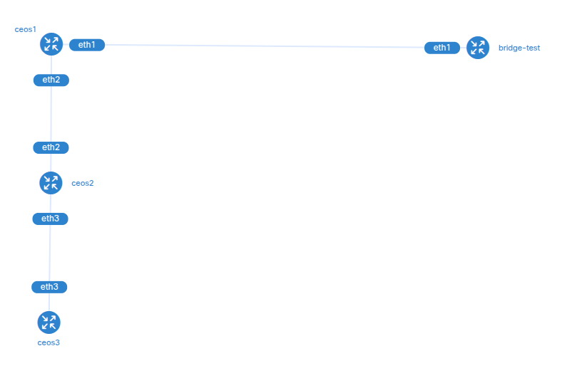

# containerlab-with-vlan-bridge


Example of how a containerlab topology can connect to a Linux bridge.  
One application of this is to be able to connect a hardware device to a cEOS-lab in a containerlab topology (for example, an Arista AP), to perform some test.

## Commands to create the bridge and add the physical interface (enx5c288608feae) to the bridge
```
ip link del bridge-test 
ip link add bridge-test type bridge
ip link set dev enx5c288608feae master bridge-test
ip link set dev bridge-test up

! verification

ip -d link show bridge-test
bridge fdb show dev bridge-test   
bridge link

```

## Network diagram:
